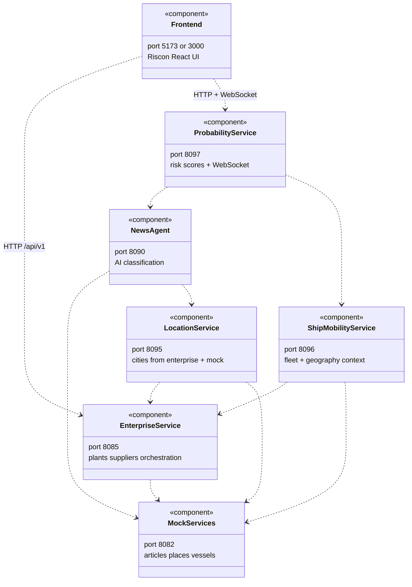
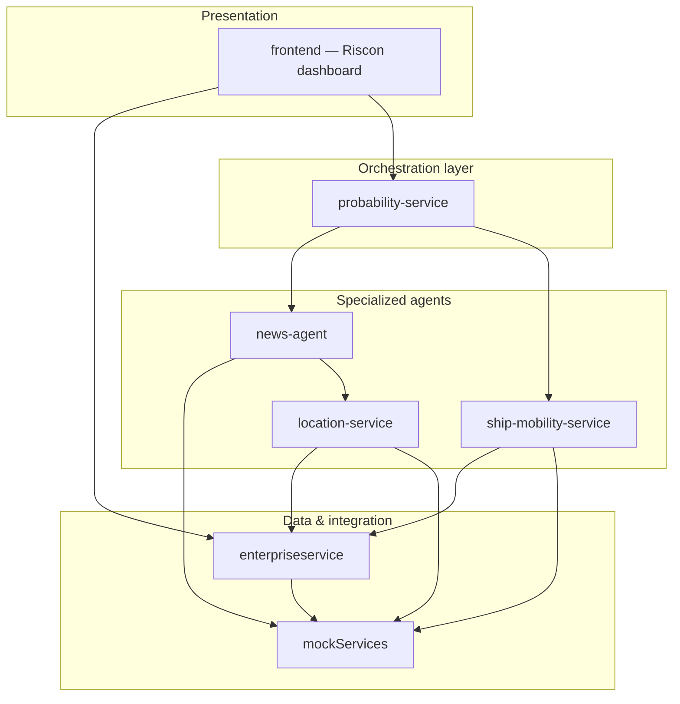
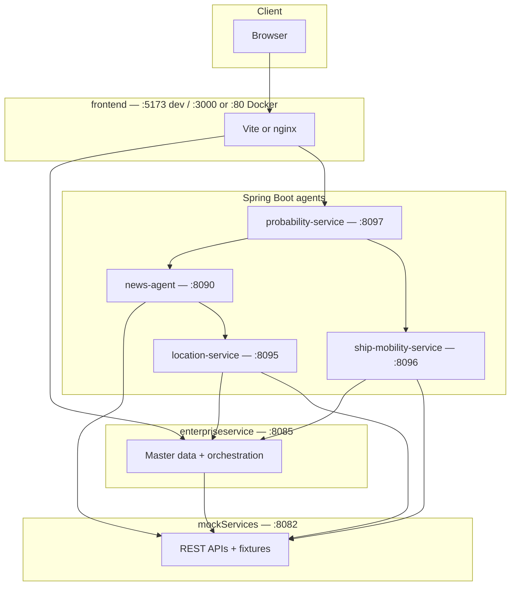
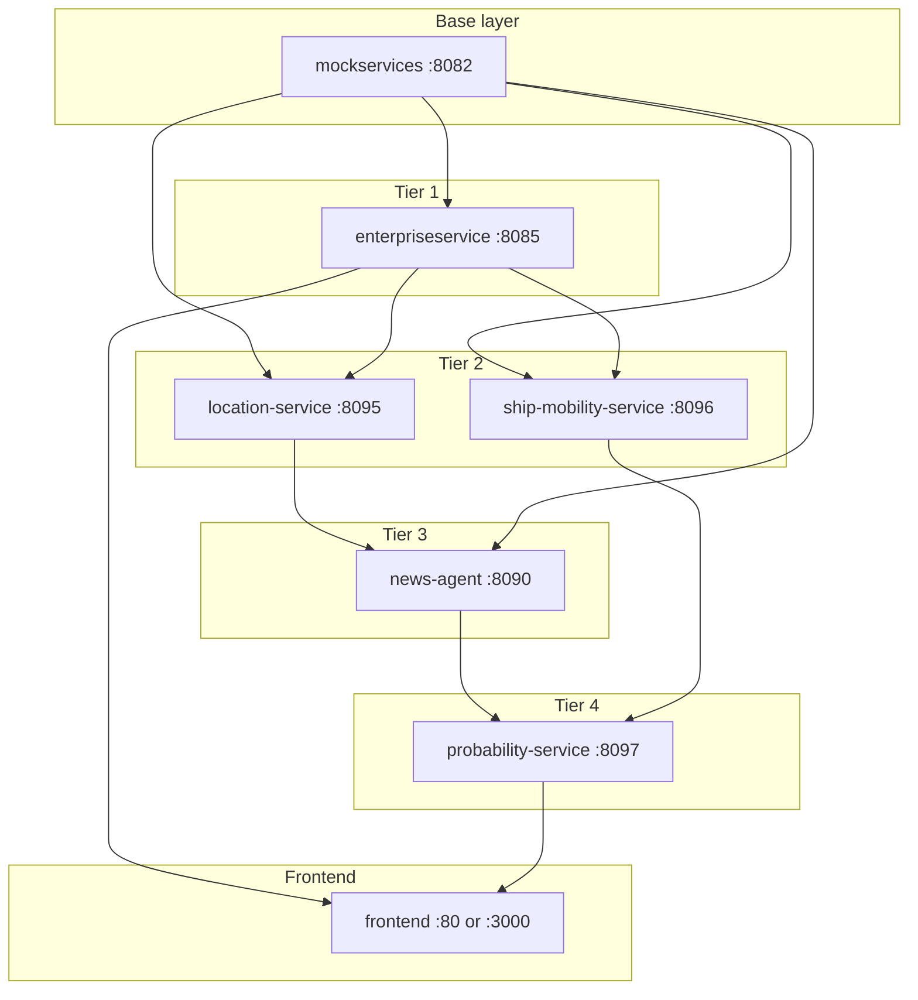
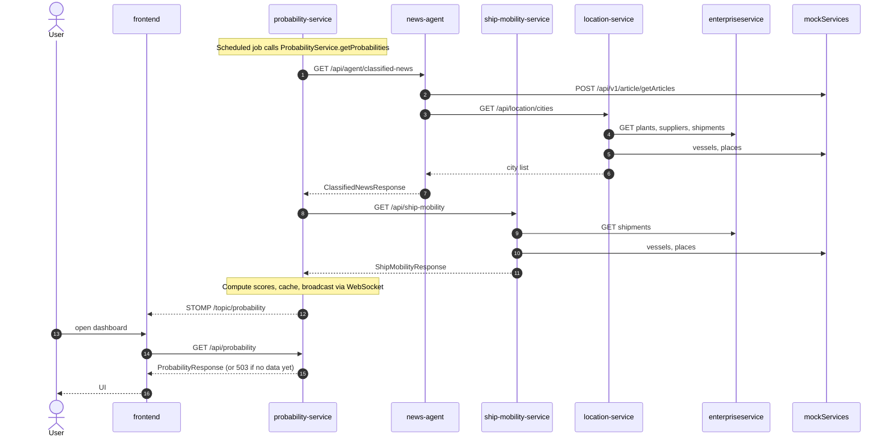

# CursorHackathon — supply-chain risk & reasoning demo

This repository is a **hackathon-style reference solution** for **supply-chain visibility**: mock **news**, **geography**, and **maritime** data feed specialized **Spring Boot agents**, which orchestrate **reasoning** over articles and **portfolio risk** against **enterprise** plants and suppliers. The primary user interface is the **Riscon** React app in [`frontend/`](frontend/). Optional tooling and deeper API notes live under [`agents/readme.md`](agents/readme.md), [`enterpriseservice/readme.md`](enterpriseservice/readme.md), and [`MTA.md`](MTA.md).

---

## What the solution does

| Layer | Role |
|--------|------|
| **mockServices** | Shared HTTP APIs backed by JSON fixtures: articles, place catalog, vessel search by area. |
| **enterpriseservice** | In-memory **H2** master data: plants, suppliers, shipments; **orchestration** snapshots pull mock news/vessels for map context. |
| **Agents** | **news-agent** (AI classification), **location-service** (cities from enterprise + mock), **ship-mobility-service** (fleet + geography), **probability-service** (risk scores + WebSocket push). |
| **frontend** | **Vite + React** dashboard (Riscon). |

The stack can be packaged as an SAP **MTA** (see [`mta.yaml`](mta.yaml) and [`MTA.md`](MTA.md)).

---

## Architecture (UML component view)

Deployable **components** and **HTTP** dependencies (local default ports). The browser talks to **enterpriseservice** and **probability-service** via the **frontend**; it does not call **mockServices** or the other agents directly.



---

## Logical layers (package-style view)

How responsibilities group in the solution (not a deployment diagram; folders map loosely to these layers).



---

## Deployment-style view (runtime)

End-to-end flow: browser → **frontend** → enterpriseservice / probability-service → agents → mock. Arrows are **call direction** over HTTP. The **frontend** proxies to enterpriseservice (master data, orchestration) and probability-service (risk scores, WebSocket push).



---

## Docker startup order (healthchecks)

When using Docker Compose, services start in dependency order. Each service has a **healthcheck** so downstream services wait until dependencies are ready (avoids `ClosedChannelException` and startup races).



**Startup sequence:** mockservices → enterpriseservice → location-service + ship-mobility-service (parallel) → news-agent → probability-service → frontend.

---

## UML sequence: probability refresh (high level)

One important end-to-end path: **probability-service** fetches **classified news** from news-agent (which uses location-service and mockServices) and **ship mobility** from ship-mobility-service, computes risk scores, caches the result, and broadcasts via WebSocket. The frontend subscribes to `/topic/probability` and calls `GET /api/probability` for the latest snapshot. Details are in [`agents/readme.md`](agents/readme.md#uml-sequence-probability-refresh).



---

## Repository layout (abbreviated)

```
CursorHackathon/
├── frontend/              # Riscon — primary React UI (Vite)
├── mockServices/          # Mock REST APIs (Spring Boot)
├── enterpriseservice/     # Master data + orchestration (Spring Boot + H2)
├── agents/
│   ├── news-agent/        # AI classification (LangChain4j + Claude)
│   ├── location-service/  # Cities from enterprise + mock
│   ├── ship-mobility-service/  # Fleet + geography context
│   ├── probability-service/   # Risk scores + WebSocket push
│   └── readme.md          # Port map, curl examples, full diagrams
├── deploy/                # Droplet deployment scripts
├── docker-compose.yml     # Local development
├── docker-compose.droplet.yml  # Droplet deployment (build from source)
├── mta.yaml               # SAP MTA module list
├── MTA.md                 # Build / deploy notes
└── README.md              # This file
```

---

## Prerequisites

- **Java 21** and **Maven** for Spring Boot modules  
- **Node.js** (recommended **22.12+** or **20.19+** for Vite 8) and **npm** for `frontend/`  
- Optional: [Cloud MTA Build Tool](https://github.com/SAP/cloud-mta-build-tool) (`mbt`) for `mta.yaml` builds  

---

## Run locally (summary)

1. Start **mockServices** first, then **enterpriseservice**, then the **agents** in order (see [`agents/readme.md`](agents/readme.md#run-the-full-stack-smoke-test)).  
2. Start **`frontend`**: `cd frontend && npm install && npm run dev` → open **http://localhost:5173** (or the port Vite prints).  

Default ports: **8082** mock, **8085** enterprise, **8090** news-agent, **8095** location-service, **8096** ship-mobility-service, **8097** probability-service, **5173** Vite (frontend).

### Docker Compose

**Local development** (ports 3000, 8090–8097, 8085):

```bash
export ANTHROPIC_API_KEY=sk-ant-...
docker compose up --build
```

**Droplet deployment** (build from source, only port 80 exposed):

```bash
export ANTHROPIC_API_KEY=sk-ant-...
docker compose -f docker-compose.droplet.yml up -d --build
```

Docker Compose uses **healthchecks** and `depends_on: condition: service_healthy` so services start in the correct order; no manual startup sequencing is needed.

---

## Documentation index

| Document | Content |
|----------|---------|
| [`agents/readme.md`](agents/readme.md) | Agent APIs, mock paths, full UML diagrams, smoke-test commands |
| [`enterpriseservice/readme.md`](enterpriseservice/readme.md) | Enterprise API, H2, seed data |
| [`deploy/`](deploy/) | Droplet deployment scripts (`create-droplet.sh`, `manual-setup-droplet.sh`) |
| [`MTA.md`](MTA.md) | `mbt build`, `.mtar` output, deploy notes |
| [`mta.yaml`](mta.yaml) | MTA module definitions |
