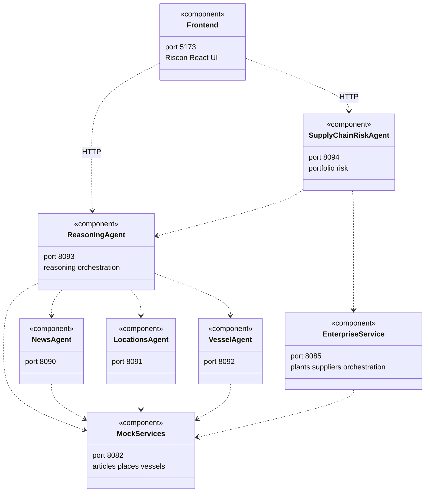
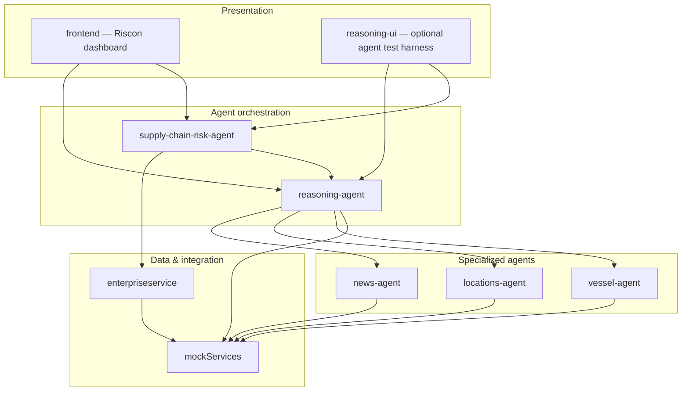
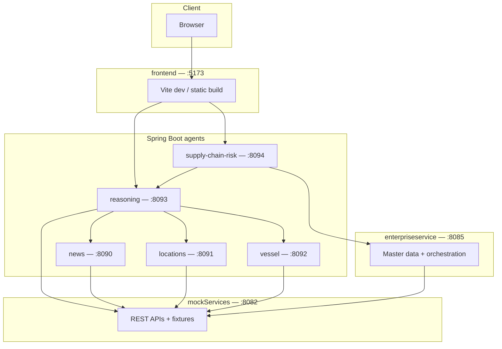
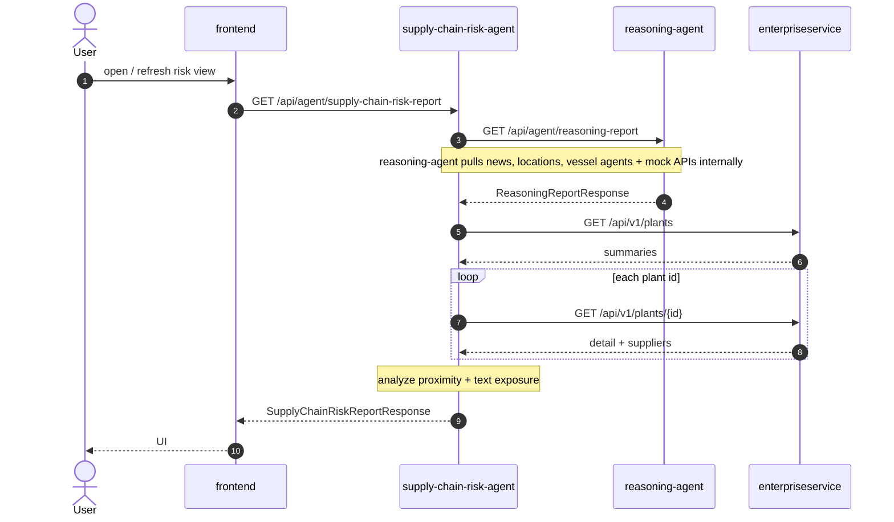

# CursorHackathon — supply-chain risk & reasoning demo

This repository is a **hackathon-style reference solution** for **supply-chain visibility**: mock **news**, **geography**, and **maritime** data feed specialized **Spring Boot agents**, which orchestrate **reasoning** over articles and **portfolio risk** against **enterprise** plants and suppliers. The primary user interface is the **Riscon** React app in [`frontend/`](frontend/). Optional tooling and deeper API notes live under [`agents/readme.md`](agents/readme.md), [`enterpriseservice/readme.md`](enterpriseservice/readme.md), and [`MTA.md`](MTA.md).

---

## What the solution does

| Layer | Role |
|--------|------|
| **mockServices** | Shared HTTP APIs backed by JSON fixtures: articles, place catalog, vessel search by area. |
| **enterpriseservice** | In-memory **H2** master data: plants, suppliers, shipments; **orchestration** snapshots pull mock news/vessels for map context. |
| **Agents** | **News** classification, **location** resolution, **vessel** proximity, **reasoning** pipeline (orchestration), **supply-chain risk** (enterprise + reasoning). |
| **frontend** | **Vite + React** dashboard (Riscon). |
| **reasoning-ui** | **Dev-only** thin client to exercise agent APIs (not the product UI). |

The stack can be packaged as an SAP **MTA** (see [`mta.yaml`](mta.yaml) and [`MTA.md`](MTA.md)).

---

## Architecture (UML component view)

Deployable **components** and **HTTP** dependencies (local default ports). The browser talks to **agents** only via the **frontend** (or the optional test harness); it does not call **mockServices** or **enterpriseservice** directly.



---

## Logical layers (package-style view)

How responsibilities group in the solution (not a deployment diagram; folders map loosely to these layers).



---

## Deployment-style view (runtime)

End-to-end flow: browser → **frontend** → agents → mock or enterprise. Arrows are **call direction** over HTTP. The **frontend** app calls agent URLs from configuration or your platform’s **approuter** (the repo’s default Vite config does not add a dev proxy; [`reasoning-ui/`](reasoning-ui/) is a small optional harness that does proxy `/api` for local testing).



---

## UML sequence: supply-chain risk report (high level)

One important end-to-end path: the **supply-chain-risk-agent** loads a **reasoning** report first, then **enterprise** plants, then runs **in-process** risk analysis. Details match [`SupplyChainRiskService`](agents/supply-chain-risk-agent/src/main/java/com/hackathon/supplychainrisk/service/SupplyChainRiskService.java).



A fuller sequence (including **news / locations / vessel** agents and **mockServices**) is in [`agents/readme.md`](agents/readme.md#uml-sequence-supply-chain-risk-report).

---

## Repository layout (abbreviated)

```
CursorHackathon/
├── frontend/              # Riscon — primary React UI (Vite)
├── reasoning-ui/          # Optional dev harness for agent APIs
├── mockServices/          # Mock REST APIs (Spring Boot)
├── enterpriseservice/     # Master data + orchestration (Spring Boot + H2)
├── agents/
│   ├── news-agent/
│   ├── locations-agent/
│   ├── vessel-agent/
│   ├── reasoning-agent/
│   ├── supply-chain-risk-agent/
│   └── readme.md          # Port map, curl examples, full diagrams
├── mta.yaml               # SAP MTA module list
├── MTA.md                 # Build / deploy notes
└── README.md              # This file
```

---

## Prerequisites

- **Java 21** and **Maven** for Spring Boot modules  
- **Node.js** (recommended **22.12+** or **20.19+** for Vite 8) and **npm** for `frontend/`  
- Optional: [Cloud MTA Build Tool](https://github.com/SAP/cloud-mta-build-tool) (`mbt`) for `mta.yaml` builds  

---

## Run locally (summary)

1. Start **mockServices** first, then **enterpriseservice**, then the **agents** in order (see [`agents/readme.md`](agents/readme.md#run-the-full-stack-smoke-test)).  
2. Start **`frontend`**: `cd frontend && npm install && npm run dev` → open **http://localhost:5173** (or the port Vite prints).  
3. Use **`reasoning-ui`** only if you want a minimal proxy to agents for testing; do not run it on the same port as **`frontend`**.  

Default ports: **8082** mock, **8085** enterprise, **8090–8094** agents, **5173** Vite (frontend).

---

## Documentation index

| Document | Content |
|----------|---------|
| [`agents/readme.md`](agents/readme.md) | Agent APIs, mock paths, full UML diagrams, smoke-test commands |
| [`enterpriseservice/readme.md`](enterpriseservice/readme.md) | Enterprise API, H2, seed data |
| [`MTA.md`](MTA.md) | `mbt build`, `.mtar` output, deploy notes |
| [`mta.yaml`](mta.yaml) | MTA module definitions |
