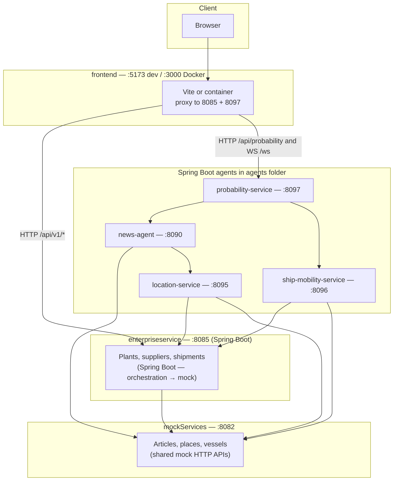
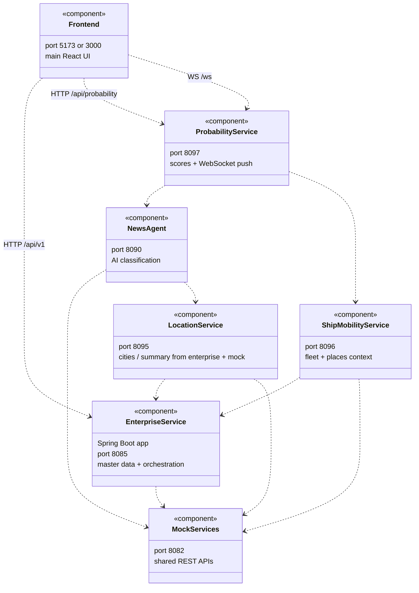
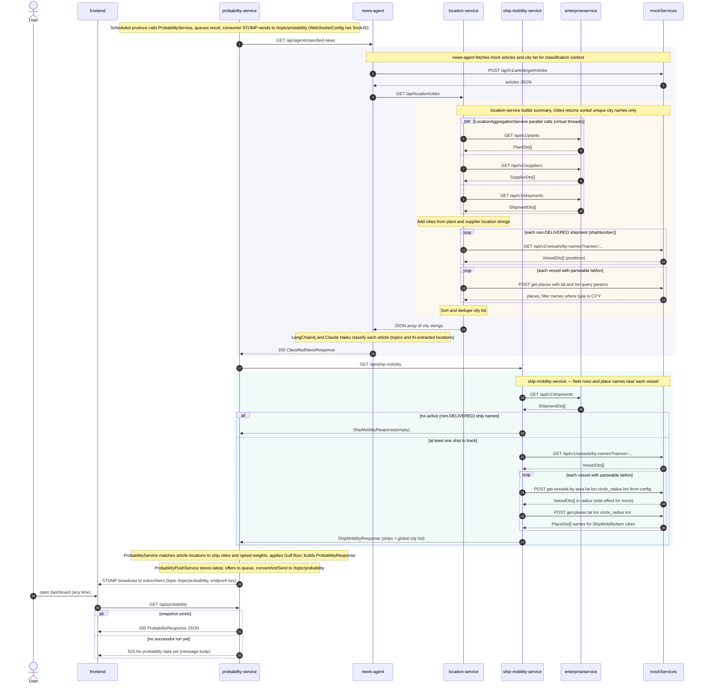

# Agents

## Architecture

High-level view of how the **CursorHackathon** stack fits together: shared mock APIs, **[`enterpriseservice`](../enterpriseservice)** (Spring Boot, repo root folder — not under `agents/`), four Spring Boot **agents** under `agents/`, and the React **`frontend/`** (Vite). The browser talks to **enterpriseservice** for `/api/v1/*` and to **probability-service** for REST + WebSocket push. Ports below are **local defaults**; see [Port map](#port-map-local-defaults) and [`docker-compose.yml`](../docker-compose.yml).



### UML (component & dependency view)

Each box is a deployable **component**; arrows are **HTTP** (or **WS** where noted).



### UML (sequence): probability refresh

**probability-service** pulls **classified news** (AI) and **ship mobility**, merges them into **probability items**, caches the latest snapshot, and **broadcasts** on **`/topic/probability`** (STOMP). **`GET /api/probability`** returns the last successful snapshot (or **503** if none yet). Scheduling is implemented in [`ProbabilityPushService`](probability-service/src/main/java/com/hackathon/probability/service/ProbabilityPushService.java).

Implementation detail for the diagram below: **location-service** aggregation is [`LocationAggregationService#getLocationSummary`](location-service/src/main/java/com/hackathon/locationservice/service/LocationAggregationService.java); **ship-mobility** is [`ShipMobilityService#getShipMobility`](ship-mobility-service/src/main/java/com/hackathon/shipmobility/service/ShipMobilityService.java); mock clients are [`location-service/MockServicesClient`](location-service/src/main/java/com/hackathon/locationservice/client/MockServicesClient.java) and [`ship-mobility-service/MockServicesClient`](ship-mobility-service/src/main/java/com/hackathon/shipmobility/client/MockServicesClient.java).



**Reading the diagram:** The **UI** does not call **news-agent**, **location-service**, or **ship-mobility-service** directly in the default setup; it uses **probability-service** and **enterpriseservice** through the dev proxy (see [`frontend/vite.config.ts`](../frontend/vite.config.ts)).

---

This folder holds **Spring Boot agents** that integrate with [`../mockServices`](../mockServices) and [`../enterpriseservice`](../enterpriseservice).

**Active Maven modules** (each has a `pom.xml`): **`news-agent`**, **`location-service`**, **`ship-mobility-service`**, **`probability-service`**.

**Leftover directories (not buildable here):** `locations-agent/`, `vessel-agent/`, `supply-chain-risk-agent/` (typically only `target/` or stale artifacts), and `reasoning-agent/` without a top-level `pom.xml`. Treat them as **removed or legacy**; do not use the old port map **8091–8094** for this branch.

**Deployment:** Repo root includes an SAP **MTA** descriptor — [`../mta.yaml`](../mta.yaml) and [`../MTA.md`](../MTA.md) (`mbt build` → `.mtar`). For local/container runs, prefer [`../docker-compose.yml`](../docker-compose.yml).

**Mock base URL (default):** `http://localhost:8082` — see `mockServices/src/main/resources/application.properties`. Regenerate large JSON fixtures from the repo root:

```bash
python3 mockServices/scripts/generate_mock_data.py
```

| Service | Port | Package | Role |
|---------|------|---------|------|
| **news-agent** | **8090** | `com.hackathon.newsagent` | **LangChain4j + Claude Haiku:** classify mock articles; uses **location-service** for city context. |
| **location-service** | **8095** | `com.hackathon.locationservice` | **Aggregates** unique cities / summary from **enterprise** + **mock** (plants, suppliers, vessels). |
| **ship-mobility-service** | **8096** | `com.hackathon.shipmobility` | **Fleet + geography** context from **enterprise** + **mock** for probability scoring. |
| **probability-service** | **8097** | `com.hackathon.probability` | Combines **news-agent** + **ship-mobility**; **REST** snapshot + **WebSocket** push. |

**Mock endpoints used (indirectly via agents)**

| Mock path | Method | Used by |
|-----------|--------|---------|
| `/api/v1/article/getArticles` | `POST` | news-agent |
| `/api/v1/places` | `GET` | location-service, ship-mobility-service |
| `/api/vessels_operations/get-vessels-by-area` | `POST` | location-service, ship-mobility-service |

---

## Shared prerequisites

- **Java 21**
- **Maven**
- **Node.js** + **npm** (for `frontend/`)
- **Anthropic API key** for news-agent (`ANTHROPIC_API_KEY`)

### Run mock + enterprise first

```bash
cd mockServices && mvn spring-boot:run
cd enterpriseservice && mvn spring-boot:run
```

### Port map (local defaults)

| Port | Process |
|------|---------|
| **8082** | `mockServices` |
| **8085** | [`enterpriseservice`](../enterpriseservice) |
| **8090** | news-agent |
| **8095** | location-service |
| **8096** | ship-mobility-service |
| **8097** | probability-service |
| **5173** | [`frontend`](../frontend) Vite dev (`npm run dev`) |
| **3000** | `frontend` via Docker Compose (mapped to container **8080**) |

### Docker Compose (full stack)

From the repository root (requires **`ANTHROPIC_API_KEY`** in the environment for news-agent):

```bash
export ANTHROPIC_API_KEY=sk-ant-...
docker compose up --build
```

- UI: **http://localhost:3000**
- Internal **mockservices** has **no** host port; **8090, 8095, 8096, 8097, 8085** are published as in [`docker-compose.yml`](../docker-compose.yml).

### Run the full stack locally (smoke test)

Use **separate terminals**. Order matters: **mock → enterprise → location-service → ship-mobility → news-agent → probability-service → frontend**.

```bash
cd mockServices && mvn spring-boot:run
cd enterpriseservice && mvn spring-boot:run
cd agents/location-service && mvn spring-boot:run
cd agents/ship-mobility-service && mvn spring-boot:run
cd agents/news-agent && mvn spring-boot:run
cd agents/probability-service && mvn spring-boot:run
cd frontend && npm install && npm run dev
```

Quick checks:

```bash
curl -sf "http://localhost:8082/api/v1/places" | head -c 80 && echo
curl -sf "http://localhost:8085/api/v1/plants" | head -c 80 && echo
curl -sf "http://localhost:8095/api/location/cities" | head -c 80 && echo
curl -sf "http://localhost:8096/api/ship-mobility" | head -c 80 && echo
curl -sf "http://localhost:8090/api/agent/classified-news" | head -c 80 && echo
curl -sf "http://localhost:8097/api/probability" | head -c 80 && echo
```

---

## news-agent

Supply-chain **news classification** using **LangChain4j** and **Claude Haiku**: loads articles from the mock API, pulls **city context** from **location-service**, classifies each article (concurrent workers), returns **`topics`**, **`locations`**, and related fields per article.

### Run

```bash
cd agents/news-agent && mvn spring-boot:run
```

**Required:** `ANTHROPIC_API_KEY`.

### Configuration

| Property | Default | Purpose |
|----------|---------|---------|
| `news.mock-services-url` | `http://localhost:8082` | Mock service base URL |
| `news.location-service-url` | `http://localhost:8095` | Location service base URL |
| `news.classification-threads` | `2` | Concurrency (rate-limit friendly) |
| `server.port` | `8090` | Agent port |
| `ANTHROPIC_API_KEY` | (env) | Anthropic API key |

### HTTP API

| Method | Path | Description |
|--------|------|-------------|
| `GET` | `/api/agent/classified-news` | Classify all articles from the mock news API |

```bash
curl -s "http://localhost:8090/api/agent/classified-news" | python3 -m json.tool
```

If mock news or location-service is unreachable: **503** with `{ "message": "..." }`.

### Build

```bash
cd agents/news-agent && mvn -q compile
```

---

## location-service

Aggregates **enterprise** plants/suppliers and **mock** vessels/places to produce **unique cities** and a **location summary** for downstream AI and analytics.

### Run

```bash
cd agents/location-service && mvn spring-boot:run
```

### Configuration

| Property | Default | Purpose |
|----------|---------|---------|
| `location-service.enterprise-base-url` | `http://localhost:8085` | Enterprise service |
| `location-service.mock-services-base-url` | `http://localhost:8082` | Mock service |
| `location-service.nearby-radius-km` | `200` | Haversine radius for “nearby” context |
| `server.port` | `8095` | Service port |

### HTTP API

| Method | Path | Description |
|--------|------|-------------|
| `GET` | `/api/location/cities` | Unique city names |
| `GET` | `/api/location/summary` | Cities + structured plant/supplier summary |

```bash
curl -s "http://localhost:8095/api/location/cities" | python3 -m json.tool
curl -s "http://localhost:8095/api/location/summary" | python3 -m json.tool
```

### Build

```bash
cd agents/location-service && mvn -q compile
```

---

## ship-mobility-service

Builds a **ship mobility** snapshot from **enterprise** and **mock** data (vessels, places) for use by **probability-service**.

### Run

```bash
cd agents/ship-mobility-service && mvn spring-boot:run
```

### Configuration

| Property | Default | Purpose |
|----------|---------|---------|
| `ship-mobility.enterprise-base-url` | `http://localhost:8085` | Enterprise service |
| `ship-mobility.mock-services-base-url` | `http://localhost:8082` | Mock service |
| `ship-mobility.nearby-radius-km` | `200` | Radius for nearby places / area queries |
| `server.port` | `8096` | Service port |

### HTTP API

| Method | Path | Description |
|--------|------|-------------|
| `GET` | `/api/ship-mobility` | Current mobility snapshot (`ShipMobilityResponse`) |

```bash
curl -s "http://localhost:8096/api/ship-mobility" | python3 -m json.tool
```

### Build

```bash
cd agents/ship-mobility-service && mvn -q compile
```

---

## probability-service

Fuses **news-agent** output with **ship-mobility-service** to produce **probability** items (percent scores, article metadata). Exposes:

- **`GET /api/probability`** — last computed snapshot (**503** if none yet).
- **WebSocket (STOMP)** — SockJS endpoint **`/ws`**, broker topic **`/topic/probability`** (see [`WebSocketConfig`](probability-service/src/main/java/com/hackathon/probability/config/WebSocketConfig.java)).

Recompute cadence is **scheduled** in [`ProbabilityPushService`](probability-service/src/main/java/com/hackathon/probability/service/ProbabilityPushService.java) (news-agent AI calls can be slow; adjust there if needed).

### Run

Requires **8090** (news-agent) and **8096** (ship-mobility-service), with **8082**, **8085**, **8095** available upstream.

```bash
cd agents/probability-service && mvn spring-boot:run
```

### Configuration

| Property | Default | Purpose |
|----------|---------|---------|
| `probability.news-agent-url` | `http://localhost:8090` | news-agent base URL |
| `probability.ship-mobility-url` | `http://localhost:8096` | ship-mobility-service base URL |
| `probability.news-agent-timeout-seconds` | `120` | HTTP timeout for classified-news |
| `probability.weight-speed-low` | `3` | Scoring weight |
| `probability.weight-location-match` | `5` | Scoring weight |
| `probability.weight-location-and-speed` | `8` | Scoring weight |
| `probability.speed-threshold-kn` | `5` | “Low speed” threshold |
| `probability.max-score` | `80` | Normalization cap |
| `probability.gulf-locations` | (list) | Region keywords for minimum risk floor |
| `probability.gulf-min-percent` | `75` | Minimum percent for Gulf-tagged articles |
| `server.port` | `8097` | Service port |

### HTTP API

| Method | Path | Description |
|--------|------|-------------|
| `GET` | `/api/probability` | Latest `ProbabilityResponse` JSON |

```bash
curl -s "http://localhost:8097/api/probability" | python3 -m json.tool
```

### Build

```bash
cd agents/probability-service && mvn -q compile
```

---

## Project layout

```
agents/
├── readme.md
├── news-agent/
│   ├── pom.xml
│   ├── Dockerfile
│   └── src/main/java/com/hackathon/newsagent/...
├── location-service/
│   ├── pom.xml
│   ├── Dockerfile
│   └── src/main/java/com/hackathon/locationservice/...
├── ship-mobility-service/
│   ├── pom.xml
│   ├── Dockerfile
│   └── src/main/java/com/hackathon/shipmobility/...
└── probability-service/
    ├── pom.xml
    ├── Dockerfile
    └── src/main/java/com/hackathon/probability/...
```

---

## Legacy stack (reference only)

Older documentation and forks sometimes describe **locations-agent (8091)**, **vessel-agent (8092)**, **reasoning-agent (8093)**, and **supply-chain-risk-agent (8094)** with a **reasoning → simulation** UI proxy. That architecture is **not** what this branch builds: the **product UI** integrates via **enterpriseservice** + **probability-service** as above. If you need the previous orchestration agents, recover them from git history or another branch.
