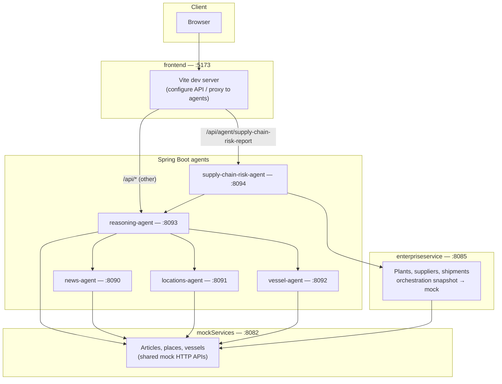
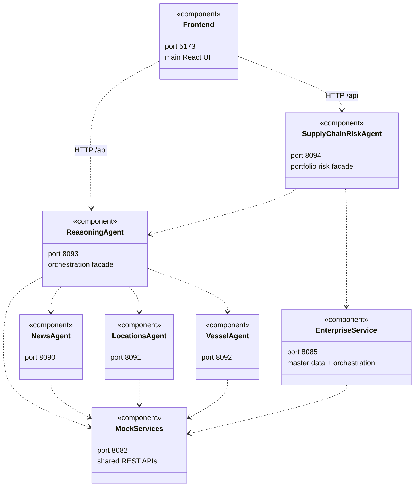
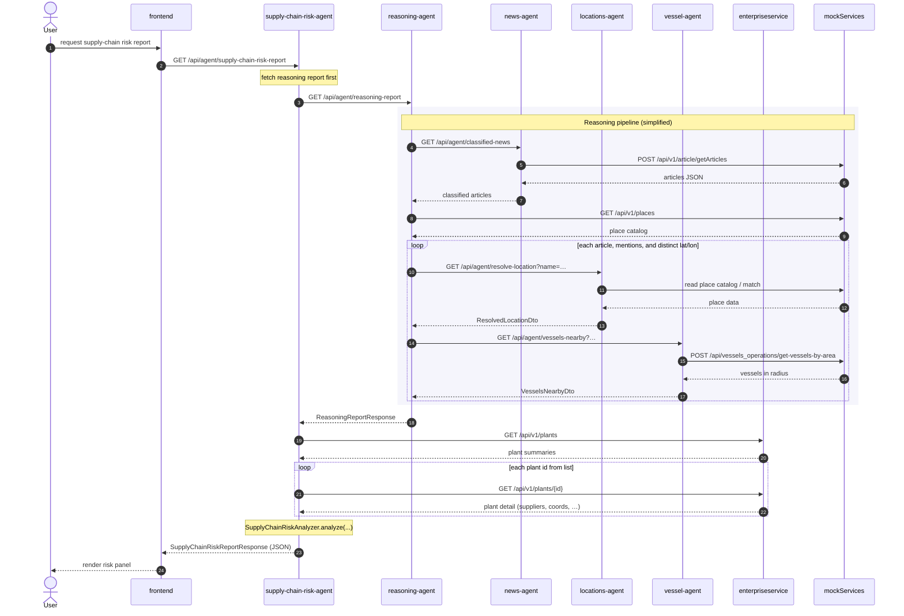

# Agents

## Architecture

High-level view of how the **CursorHackathon** stack fits together: shared mock APIs and enterprise master data, specialized agents, orchestration, and the React UI. The **primary** user-facing app is **`frontend/`** (Vite + React). **`reasoning-ui/`** is a **small test harness** for manually hitting agent APIs during development (not the product UI). Ports are **local defaults** (see [Port map](#port-map-local-defaults) below).



### UML (component & dependency view)

Same stack as a **UML-style** diagram: each box is a deployable **component** (Spring Boot app or static UI); arrows are **HTTP** dependencies (clients call servers). Stereotypes note default ports. The browser app shown here is **`frontend`**; **`reasoning-ui`** is omitted (same pattern, test-only).



### UML (sequence): supply-chain risk report

Typical flow for **GET** `/api/agent/supply-chain-risk-report` (optional `radiusNm`) from the **browser** via **`frontend`** (or the optional **`reasoning-ui`** test harness with a dev proxy). Implementation order in [`SupplyChainRiskService#buildReport`](supply-chain-risk-agent/src/main/java/com/hackathon/supplychainrisk/service/SupplyChainRiskService.java): **reasoning** report first, then **enterprise** plant list and **per-plant** detail, then **in-process** analysis. The **reasoning** block mirrors [`ReasoningPipelineService`](reasoning-agent/src/main/java/com/hackathon/reasoningagent/service/ReasoningPipelineService.java) (news → catalog → per-mention resolve → vessels).



**Reading the diagram:** **reasoning-agent** orchestrates **news**, **locations**, and **vessel** agents and reads **mockServices** directly where needed. **supply-chain-risk-agent** composes **enterpriseservice** master data with a **reasoning** report for portfolio-style risk. **frontend** (and the optional **reasoning-ui** test harness) call **agents** over HTTP — not **mockServices** or **enterpriseservice** directly. **enterpriseservice** uses **mockServices** for orchestration snapshots (e.g. news/vessels near coordinates).

---

This folder holds **Spring Boot agents** that sit on top of the shared mock APIs in [`../mockServices`](../mockServices) (`mockServices`). Each agent calls HTTP endpoints on the mock service and exposes its own JSON API.

**Deployment:** The repo root includes an SAP **MTA** descriptor — [`../mta.yaml`](../mta.yaml) and [`../MTA.md`](../MTA.md) (build with `mbt build` → `.mtar`).

**Mock service base URL (default):** `http://localhost:8082` — see `mockServices/src/main/resources/application.properties`. Large mock datasets (`mock_articles.json`, `mock_places.json`, `mock_vessels.json`) can be regenerated from the repository root with:

```bash
python3 mockServices/scripts/generate_mock_data.py
```

| Agent | Port | Package | Role |
|-------|------|---------|------|
| **news-agent** | **8090** | `com.hackathon.newsagent` | Classify news into supply-chain risk categories (multi-label, lexicon). |
| **locations-agent** | **8091** | `com.hackathon.locationsagent` | Resolve **place names → coordinates** (catalog + fuzzy matching). |
| **vessel-agent** | **8092** | `com.hackathon.vesselagent` | List **vessels near a point** using lat/lon + **radius (km)**. |
| **reasoning-agent** | **8093** | `com.hackathon.reasoningagent` | **Orchestrates** news → locations → vessels: classified news, geo resolution, nearby ships. |
| **supply-chain-risk-agent** | **8094** | `com.hackathon.supplychainrisk` | **Portfolio risk:** enterprise plants/suppliers + reasoning report (exposure by proximity & text). |

**Mock endpoints used**

| Mock path | Method | Used by |
|-----------|--------|---------|
| `/api/v1/article/getArticles` | `POST` | news-agent |
| `/api/v1/places` | `GET` | locations-agent, reasoning-agent (mention scan) |
| `/api/vessels_operations/get-vessels-by-area` | `POST` | vessel-agent (`latitude`, `longitude`, `circle_radius` in km) |

---

## Shared prerequisites

- **Java 21**
- **Maven** (or `./mvnw` from `mockServices` when the wrapper is configured)

### Run the mock API first

From the repository root:

```bash
cd mockServices && mvn spring-boot:run
```

### Port map (local defaults)

| Port | Process |
|------|---------|
| **8082** | `mockServices` (news, places catalog, vessels, places-by-area, …) |
| **8085** | [`enterpriseservice`](../enterpriseservice) (plants, suppliers, shipments — in-memory H2) |
| **8090** | news-agent |
| **8091** | locations-agent |
| **8092** | vessel-agent |
| **8093** | reasoning-agent |
| **8094** | supply-chain-risk-agent |
| **5173** | [`frontend`](../frontend) (main UI; Vite default port) |
| **5173** | [`reasoning-ui`](../reasoning-ui) (optional **test harness** for agent APIs — same default port; run only one of `frontend` / `reasoning-ui` or use a different port, e.g. `npm run dev -- --port 5174`) |

Start each agent you need in **separate terminals**. **reasoning-agent** depends on **mockServices** plus **news-agent**, **locations-agent**, and **vessel-agent** all being up before it. **supply-chain-risk-agent** additionally needs **[`enterpriseservice`](../enterpriseservice)** on **8085** and **reasoning-agent** on **8093**.

### Run the full stack (smoke test)

Use **separate terminals** from the repo root. Start **mockServices** first; wait until **8082** is healthy (e.g. `curl -sf http://localhost:8082/api/v1/places`). Then start **news**, **locations**, **vessel**, **reasoning**. For the **supply-chain** UI panel, also start **enterpriseservice** (8085) and **supply-chain-risk-agent** (8094).

```bash
cd mockServices && mvn spring-boot:run
cd enterpriseservice && mvn spring-boot:run
cd agents/news-agent && mvn spring-boot:run
cd agents/locations-agent && mvn spring-boot:run
cd agents/vessel-agent && mvn spring-boot:run
cd agents/reasoning-agent && mvn spring-boot:run
cd agents/supply-chain-risk-agent && mvn spring-boot:run
cd frontend && npm install && npm run dev
```

Optional — **agent test harness** only (not the product UI): `cd reasoning-ui && npm install && npm run dev` (stop **frontend** first or use another port).

Quick checks:

```bash
curl -sf "http://localhost:8082/api/v1/places" | head -c 80 && echo
curl -sf "http://localhost:8090/api/agent/classified-news" | head -c 80 && echo
curl -sf "http://localhost:8091/api/agent/resolve-location?name=Dubai%20City" | head -c 80 && echo
curl -sf "http://localhost:8092/api/agent/vessels-nearby?latitude=45.05&longitude=-8.9&radiusNm=27" | head -c 80 && echo
curl -sf "http://localhost:8093/api/agent/reasoning-report" | head -c 80 && echo
curl -sf "http://localhost:8094/api/agent/supply-chain-risk-report" | head -c 80 && echo
```

**reasoning-agent note:** `catalogMentions` is filled only when a **catalog place name** appears in an article’s **title or body** (substring match). Many mock articles mention cities in the title but not the full catalog string in the body, so **zero mentions** for an article is normal. Vessel lists can be **empty** if no mock ships fall within `reasoning.pipeline.search-radius-nm` (nautical miles) of a resolved point.

**Units:** Vessel search radii are in **international nautical miles** (NM). **1 NM = 1852 m = 1.852 km** exactly. Agents convert NM → km when calling the mock Haversine API; that factor is fixed, so **no external conversion API is required**. For general-purpose or non-SI unit handling in production, **UCUM** ([ucum.org](https://ucum.org)) and Java **javax.measure** / **Indriya** are common choices.

---

## news-agent

Supply-chain **news classification**: pulls articles from the mock news API, runs a weighted lexicon over title + body, and returns the **top categories by score** (up to four), each with a **probability** (`score`, normalized within the article). A short **`summary`** line combines those leading themes with an excerpt of the article. Each article still includes **`body`** so downstream agents (e.g. reasoning-agent) can extract geography.

### Run

```bash
cd agents/news-agent && mvn spring-boot:run
```

### Configuration

| Property | Default | Purpose |
|----------|---------|---------|
| `news.api.base-url` | `http://localhost:8082` | Mock service base URL |
| `news.api.path` | `/api/v1/article/getArticles` | Article fetch (`POST`) |
| `server.port` | `8090` | Agent port |
| `agent.classification.min-score` | `0.12` | Reserved for future filtering (ranking uses top scores regardless) |
| `agent.classification.max-categories-per-article` | `4` | Cap on how many top-scoring categories are returned (up to **4**) |

### HTTP API

| Method | Path | Description |
|--------|------|-------------|
| `GET` | `/api/agent/classified-news` | Classify all articles from the news API |

```bash
curl -s "http://localhost:8090/api/agent/classified-news" | python3 -m json.tool
```

If the news API is unreachable: **503** with `{ "message": "..." }`.

### Response (summary)

- `articleCount`, `articles[]` with `uri`, `title`, **`body`**, **`summary`**, `url`, `date`, `dateTime`, `categories[]`, `shippingRouteImpact`
- `categories[]`: up to **four** highest-probability labels; each has `categoryId`, `categoryLabel`, `categoryDescription`, `score`, `matchedSignals`

Themes include geopolitical risk, trade/tariffs, disasters, logistics disruption, raw materials, cyber, and corporate restructuring. Rules live in `ArticleClassifier`.

### Build

```bash
cd agents/news-agent && mvn -q compile
```

---

## locations-agent

**Location name → coordinates** using the mock catalog (`GET /api/v1/places`). Matching: **exact** name, **substring**, **token overlap** (Jaccard), **Levenshtein**-style fuzzy score. Responses include `matchKind` and `confidence` (0–1).

### Run

```bash
cd agents/locations-agent && mvn spring-boot:run
```

### Configuration

| Property | Default | Purpose |
|----------|---------|---------|
| `locations.api.base-url` | `http://localhost:8082` | Mock service base URL |
| `locations.api.catalog-path` | `/api/v1/places` | Catalog (`GET`) |
| `server.port` | `8091` | Agent port |
| `locations.resolve.min-confidence` | `0.55` | Minimum score for a non-exact match |

### HTTP API

| Method | Path | Description |
|--------|------|-------------|
| `GET` | `/api/agent/resolve-location?name=...` | Single lookup; **404** if no match |
| `POST` | `/api/agent/resolve-locations` | Body: `{ "queries": ["…"] }` — `resolved` may be `null` |
| `POST` | `/api/agent/refresh-catalog` | Reload catalog from the mock service |

```bash
curl -s "http://localhost:8091/api/agent/resolve-location?name=Dubai%20City"
curl -s "http://localhost:8091/api/agent/resolve-locations" \
  -H "Content-Type: application/json" \
  -d '{"queries":["Strait of Hormuz","Panama","NowhereLandXYZ123"]}'
```

Sample match:

```json
{
  "query": "Dubai City",
  "matchedName": "Dubai City",
  "placeType": "CITY",
  "latitude": 25.26,
  "longitude": 55.3,
  "matchKind": "EXACT",
  "confidence": 1.0
}
```

If the catalog cannot be loaded: **503** with `{ "message": "..." }`.

### Build

```bash
cd agents/locations-agent && mvn -q compile
```

---

## vessel-agent

**Vessels near a point**: send **WGS84** `latitude` / `longitude` and a **search radius in km**. The agent calls `POST .../get-vessels-by-area` with `circle_radius` set to that radius; the mock service keeps vessels whose positions are within the Haversine distance (km).

Vessel positions in JSON are **strings** (`latitude` / `longitude`), consistent with the mock API.

### Run

```bash
cd agents/vessel-agent && mvn spring-boot:run
```

### Configuration

| Property | Default | Purpose |
|----------|---------|---------|
| `vessels.api.base-url` | `http://localhost:8082` | Mock service base URL |
| `vessels.api.path` | `/api/vessels_operations/get-vessels-by-area` | Vessel search (`POST`) |
| `server.port` | `8092` | Agent port |
| `vessels.search.default-radius-nm` | `54` | Default radius in **nautical miles** when `radiusNm` is omitted (~100 km) |

### HTTP API

| Method | Path | Description |
|--------|------|-------------|
| `GET` | `/api/agent/vessels-nearby` | Query: `latitude`, `longitude`, optional `radiusNm` (**nautical miles**) |

```bash
curl -s "http://localhost:8092/api/agent/vessels-nearby?latitude=45.05&longitude=-8.9&radiusNm=27"
```

Example response (truncated):

```json
{
  "latitude": 45.05,
  "longitude": -8.9,
  "radiusNm": 27.0,
  "vesselCount": 4,
  "vessels": [
    {
      "mmsi": "245297000",
      "name": "ELBEBORG",
      "latitude": "45.078705",
      "longitude": "-8.9553804",
      "speed": "110",
      "course": "185",
      "heading": "184"
    }
  ]
}
```

Invalid coordinates or non-positive `radiusNm`: **400**. Mock vessel API unreachable: **503** with `{ "message": "..." }`.

### Build

```bash
cd agents/vessel-agent && mvn -q compile
```

---

## reasoning-agent

**End-to-end pipeline** (no extra ML here):

1. **news-agent** — `GET /api/agent/classified-news` (articles with **title**, **body**, risk **categories**).
2. **Place mention scan** — loads `GET /api/v1/places` (mock) and finds catalog **place names** that appear as substrings in title + body (longest names checked first to reduce noise).
3. **locations-agent** — for each distinct mention, `GET /api/agent/resolve-location?name=…` to obtain coordinates.
4. **vessel-agent** — for each **unique** resolved coordinate, `GET /api/agent/vessels-nearby` with `reasoning.pipeline.search-radius-nm` (nautical miles; deduplicates multiple place names that map to the same point).

Requires **mockServices** plus **news**, **locations**, and **vessel** agents running. Returns **503** if any upstream HTTP call fails.

### Run

```bash
cd agents/reasoning-agent && mvn spring-boot:run
```

### Configuration

| Property | Default | Purpose |
|----------|---------|---------|
| `reasoning.upstream.news-agent-base-url` | `http://localhost:8090` | news-agent |
| `reasoning.upstream.locations-agent-base-url` | `http://localhost:8091` | locations-agent |
| `reasoning.upstream.vessel-agent-base-url` | `http://localhost:8092` | vessel-agent |
| `reasoning.upstream.places-catalog-url` | `http://localhost:8082/api/v1/places` | Mock catalog for substring mention detection |
| `reasoning.pipeline.search-radius-nm` | `54` | Default vessel search radius (**NM**) when `?radiusNm` is omitted (~100 km) |
| `reasoning.pipeline.min-radius-nm` | `1` | Minimum allowed `radiusNm` |
| `reasoning.pipeline.max-radius-nm` | `3000` | Maximum allowed `radiusNm` |
| `server.port` | `8093` | reasoning-agent port |

### HTTP API

| Method | Path | Description |
|--------|------|-------------|
| `GET` | `/api/agent/reasoning-report` | Full pipeline JSON |
| `GET` | `/api/agent/reasoning-report?radiusNm=100` | Same, with vessel search radius in **nautical miles** (validated against min/max; forwarded to vessel-agent) |

```bash
curl -s "http://localhost:8093/api/agent/reasoning-report" | python3 -m json.tool
curl -s "http://localhost:8093/api/agent/reasoning-report?radiusNm=100" | python3 -m json.tool
```

The response includes **`searchRadiusNm`**: the radius in **NM** used for vessel lookups on that run. Each item in `articles[]` includes `classified` (same fields as news-agent, including **`body`**), **`categoryRisks`** (per news category: composite **risk factor** 0–1 plus **rationale**), `catalogMentions`, `resolvedLocations`, and `vesselsNearLocations` (per distinct coordinate used for a vessel search; each block echoes the same radius in **`radiusNm`**).

### Web UI (React)

The main app is [`../frontend`](../frontend) (Riscon dashboard). To exercise this agent from the browser, configure your API base URL (or a dev proxy) to **`http://localhost:8093`**.

For **manual testing** only, [`../reasoning-ui`](../reasoning-ui) is a thin Vite app that **proxies** `/api` to the reasoning agent:

```bash
cd reasoning-ui && npm install && npm run dev
```

Open **http://localhost:5173** (do not run alongside **frontend** on the same port, or use `--port`). For `npm run preview` after a production build, either set **`VITE_API_BASE=http://localhost:8093`** when building, or rely on **CORS** (allowed for localhost ports **5173** and **4173** on the reasoning agent).

### Build

```bash
cd agents/reasoning-agent && mvn -q compile
```

---

## supply-chain-risk-agent

Combines **[`enterpriseservice`](../enterpriseservice)** master data with the **reasoning-agent** report:

1. **`GET /api/v1/plants`** then **`GET /api/v1/plants/{id}`** — each plant with linked **suppliers** (coordinates and names when present).
2. **`GET /api/agent/reasoning-report`** on reasoning-agent (optional **`?radiusNm=`**, forwarded as-is).
3. **Risk model:** for each reasoning article, takes the **max per-category `riskFactor`** from `categoryRisks`. A plant or supplier is **exposed** if a resolved news location is within **`supplychain-risk.proximity-radius-km`** (default **500 km**) of its lat/lon, or if **catalog mentions** / resolved place **text** overlaps the plant or supplier name/location. **Plant risk** is the max exposure score across the plant site and its suppliers; **portfolio risk** is the max across plants.

4. **Disturbance certainty:** for each exposed site, blends that **category risk** with **maritime imminence** from `vesselsNearLocations`: shortest **ETA (hours)** = great-circle distance from each vessel position to the site ÷ speed (**kn** → km/h, with a heuristic for mock speeds stored as tenths of knots). **Imminence** rises as ETA shortens (48 h half-life). **Disturbance certainty** ≈ `risk × (0.55 + 0.45 × imminence)` (capped at 1). Without vessel speed/position, imminence falls back to a weaker signal from vessel presence alone.

Returns JSON: **`portfolioRiskScore`**, **`portfolioDisturbanceCertainty`**, **`portfolioDisturbanceRationale`**, **`portfolioEstimatedHoursToImpact`**, **`portfolioRationale`**, **`plants[]`** with per-plant and per-supplier **`disturbanceCertainty`**, **`estimatedHoursToImpact`**, **`riskScore`**, and **`signals`**.

The optional **[`reasoning-ui`](../reasoning-ui)** test harness in dev uses **same-origin** `/api/...` and the Vite proxy: **`/api/agent/supply-chain-risk-report` → 8094** (listed **before** `/api` → 8093 so the longer path matches first). **`frontend`** should call agents with explicit base URLs or your platform’s approuter. `vite preview` has no proxy — set **`VITE_SUPPLY_RISK_BASE=http://localhost:8094`** when building **reasoning-ui**, or rely on the UI fallback to 8094 for localhost:4173 (CORS on the agent). **`VITE_SUPPLY_RISK_BASE`** overrides the base URL when set.

### Run

Requires **8085** (enterprise) and **8093** (reasoning), with reasoning’s upstream stack running.

```bash
cd agents/supply-chain-risk-agent && mvn spring-boot:run
```

### Configuration

| Property | Default | Purpose |
|----------|---------|---------|
| `supplychain-risk.enterprise-base-url` | `http://localhost:8085` | Enterprise service |
| `supplychain-risk.reasoning-base-url` | `http://localhost:8093` | Reasoning agent |
| `supplychain-risk.proximity-radius-km` | `500` | Great-circle distance threshold for “near” a news location |
| `supplychain-risk.http-timeout-ms` | `120000` | RestClient read/connect budget |
| `server.port` | `8094` | This agent |

### HTTP API

| Method | Path | Description |
|--------|------|-------------|
| `GET` | `/api/agent/supply-chain-risk-report` | Full report |
| `GET` | `/api/agent/supply-chain-risk-report?radiusNm=100` | Same, forwarded to reasoning-agent for vessel radius |

```bash
curl -s "http://localhost:8094/api/agent/supply-chain-risk-report" | python3 -m json.tool
```

---

## Project layout

```
agents/
├── readme.md
├── news-agent/
│   ├── pom.xml
│   └── src/main/java/com/hackathon/newsagent/...
├── locations-agent/
│   ├── pom.xml
│   └── src/main/java/com/hackathon/locationsagent/...
├── vessel-agent/
│   ├── pom.xml
│   └── src/main/java/com/hackathon/vesselagent/...
├── reasoning-agent/
│   ├── pom.xml
│   └── src/main/java/com/hackathon/reasoningagent/...
└── supply-chain-risk-agent/
    ├── pom.xml
    └── src/main/java/com/hackathon/supplychainrisk/...
```
