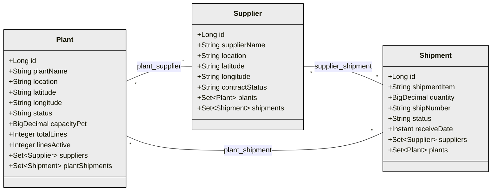
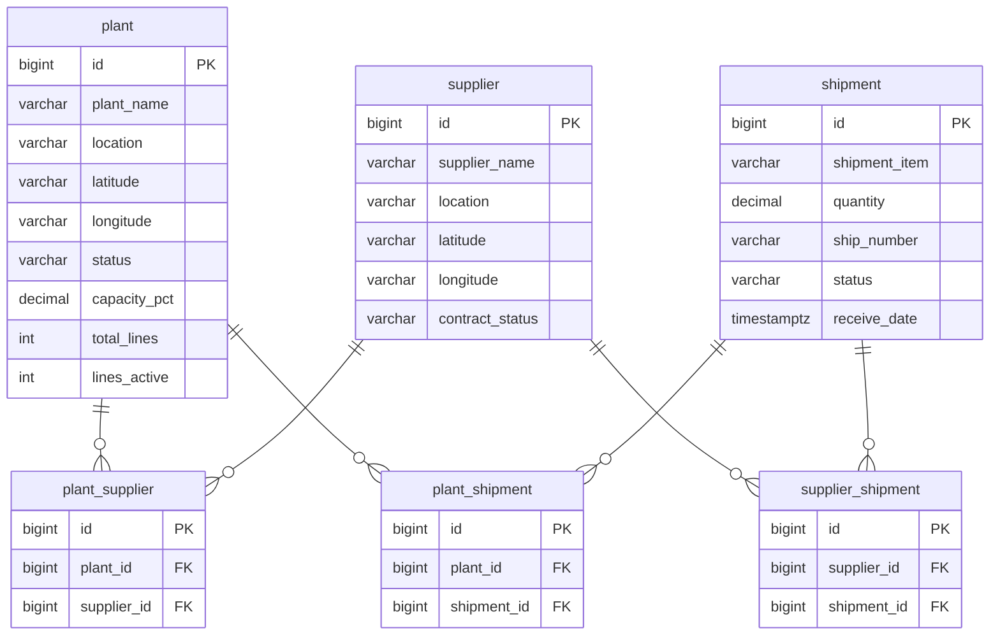
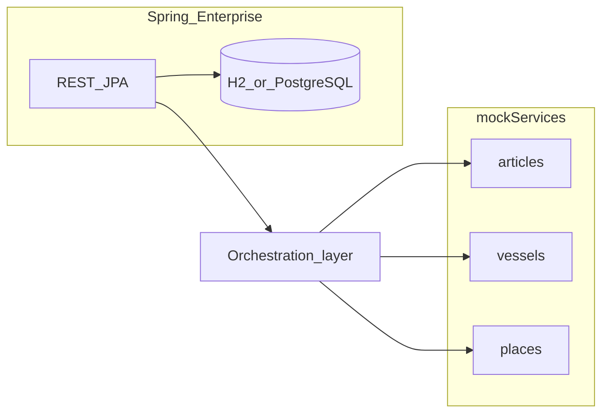

# Enterprise service — master data, mock data, orchestration

Three JPA entities — **`Plant`**, **`Supplier`**, **`Shipment`** — with **M:N** between each pair (**`@ManyToMany`** / **`@JoinTable`**). Join tables in the DB have surrogate **`id`**, two FKs, and **`UNIQUE (pair)`**; no separate link **`@Entity`** types. Use **`schema.sql`** or migrations so Hibernate **validates**. This service also aggregates mock **articles**, **vessels**, and **places** from [mockServices](../../mockServices). **Out of scope:** UI, agents, AI.

## Implementation checklist

- [x] Entities, repositories, REST, **`/api/v1/links`** for M:N pairs
- [ ] Extend `mock_places.json`; `Place` / `PlaceController` (distinct from enterprise `Shipment`)
- [ ] Optional keys between enterprise DB and mock APIs
- [ ] Orchestration tuning; config-based mock URLs
- [ ] Optional Docker / Cloud Foundry manifest

## Entity model

Reference image: [reference-entity-model-style.png](assets/reference-entity-model-style.png).

**Owning `@JoinTable`:** **`Plant`** → `plant_supplier`, `plant_shipment`; **`Supplier`** → `supplier_shipment`. **`mappedBy`** on **`Supplier.plants`** (`suppliers`), **`Shipment.suppliers`** (`shipments`), **`Shipment.plants`** (`plantShipments`). Each **`@JoinTable`** has **`@UniqueConstraint`** matching DDL **`uk_*`**.

### Domain (JPA)

### Physical (tables)

`receiveDate` maps to **`Instant`** in Java (`TIMESTAMP WITH TIME ZONE` in H2).

**Persistence:** Join tables hold links only; **`@JoinTable`** in JPA maps the two FK columns — the extra surrogate **`id`** and **`UNIQUE` pair** live in DDL (**`schema.sql`**). REST: link/unlink **[`/api/v1/links/...`](../readme.md)**.

## Runtime architecture

Orchestration: parallel **`RestClient`** calls to mock endpoints; stateless API; tune timeouts / resilience as needed.

## Mock layer

[mock_places.json](../../mockServices/src/main/resources/mock_places.json): optional `plantId` / `externalRef`, `shipments[]`; adjust Jackson / mock **`PlaceController`** as needed.

## Risks

- Name clashes (e.g. mock `GeoShipment` vs JPA `Shipment`).
- Wrong **`mappedBy`** → duplicate or conflicting join table definitions.
- Triple M:N can produce many link rows; add app rules if some combinations are invalid.
