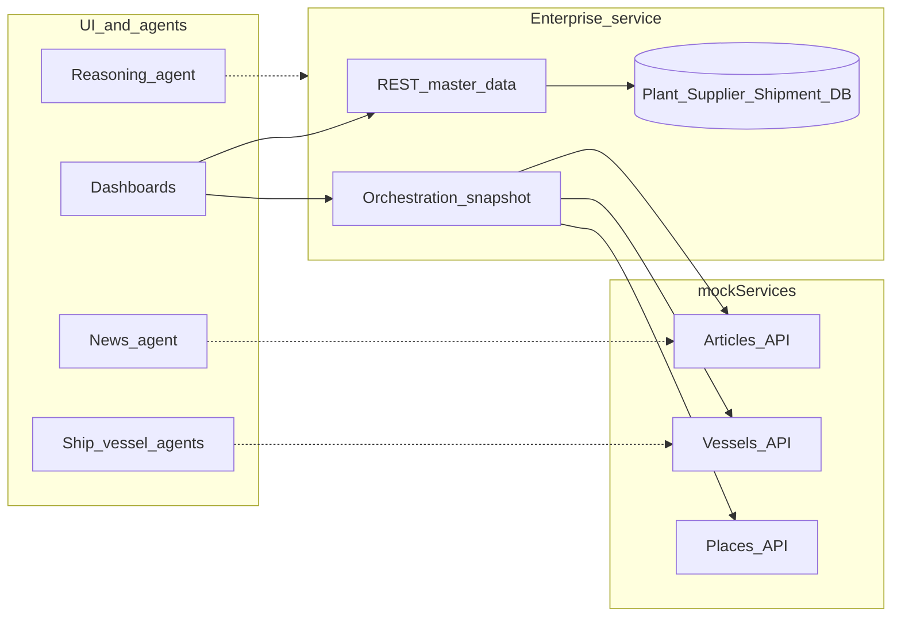
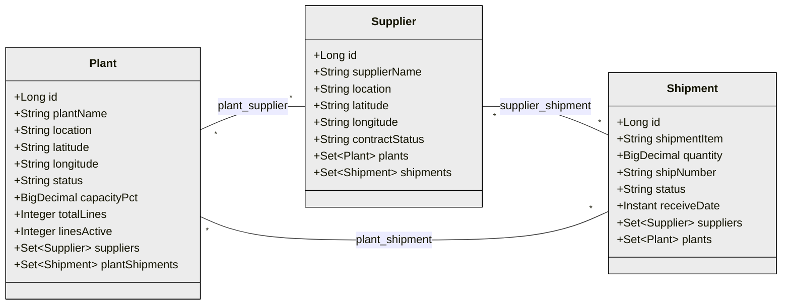
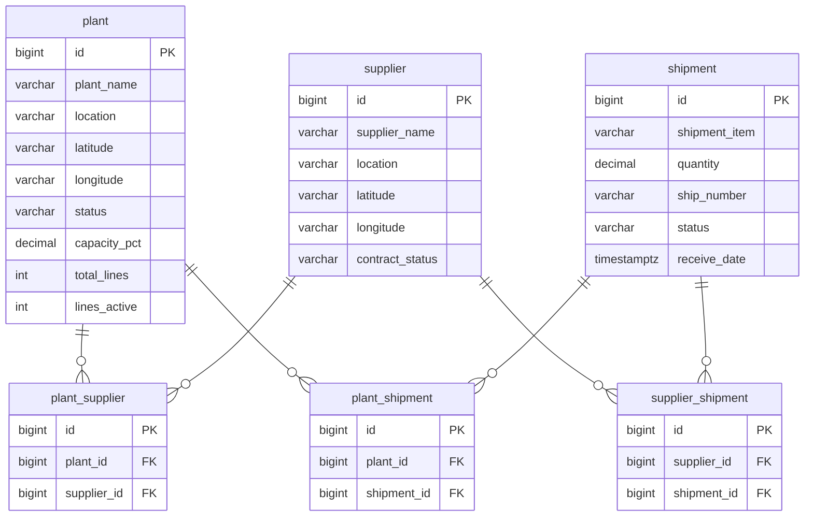
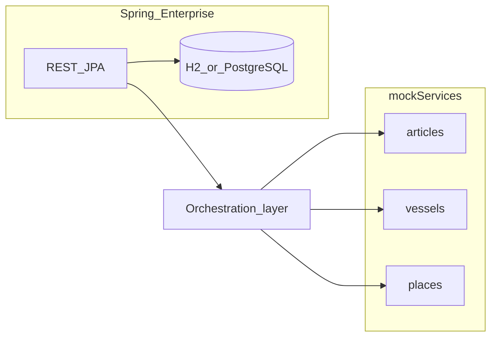

# Enterprise service — domain and technical plan

## Business context

This Spring Boot service is the **master-data and orchestration hub** for the hackathon supply-network story. It holds canonical records for **manufacturing or distribution sites** (**Plant**), **commercial partners** (**Supplier**), and **logistics movements or commitments** (**Shipment**) so dashboards and downstream logic share one source of truth.

The enterprise API does **not** replace specialized **agents** (news classification, vessel search, reasoning). Those run elsewhere (e.g. [`agents/`](../../agents)); this service **persists** core entities and **aggregates** read-only mock feeds so a **UI** or an orchestration client can paint risk and operations in one place.

## Vision and roadmap

| Direction | Intent | In this service today |
|-----------|--------|------------------------|
| **Sentiment / narrative risk** | Score news and text for exposure to disruption, reputation, or geopolitical tone | Not implemented; future integration could consume classified articles from a **news agent** or external API |
| **Risk assessment** | Combine geography, traffic, and events into alerts or scores | Not implemented; orchestration returns **raw** mock payloads for demos |
| **AI / agent-based prediction** | Proactive scenarios (“what if Hormuz slows?”) using LLM or rule agents | Not in-process; **reasoning** and other agents may call enterprise + mock APIs from outside |

**Current capability:** CRUD for **Plant** / **Supplier** / **Shipment**, **many-to-many links** between them, and **`GET /api/v1/orchestration/snapshot`** which parallel-fetches mock **articles**, **vessels**, and **places** ([`MockOrchestrationService`](../src/main/java/com/enterpriseservice/service/MockOrchestrationService.java), [`OrchestrationController`](../src/main/java/com/enterpriseservice/web/OrchestrationController.java)).

## Domain concepts (business language)

- **Plant** — A site in the network (factory, hub, port-side plant). Carries location and operational hints (capacity, lines). Often aligned with **geography** seeded from the same world model as mock **places** (see below).
- **Supplier** — A partner organization that may serve **multiple plants** and **multiple shipments** in the model.
- **Shipment** — A unit of logistics: material, quantity, vessel or consignment identifier, status, timing. In storytelling, shipments may be associated with **choke points** or lanes (e.g. cargo relevant to **Strait of Hormuz**) even when the mock JSON only encodes geography at the **place** level today.

Associations are **many-to-many** in the data model: a plant can use many suppliers; a supplier can serve many plants; shipments can relate to both through **link** APIs (no duplicate scalar FKs on the entity rows for those edges).

## Integration and data flow

- **Enterprise** → **mockServices** (HTTP): snapshot pulls **articles**, **vessels**, **places** for a given map context (see [`application.properties`](../src/main/resources/application.properties) `mock.services.base-url`).
- **Agents** in [`agents/`](../../agents) are the right place for **classification, vessel lookup, and multi-step reasoning**; wire them to the same mock base URL or to enterprise REST as the hackathon evolves.

## Mock geography and choke points

[mock_places.json](../../mockServices/src/main/resources/mock_places.json) describes **named locations** used by mock APIs: **ports, cities, countries**, and **`CHOKEPOINT`** entries (e.g. **Strait of Hormuz**, **Strait of Malacca**, **Suez Canal**). That file is the **geographic backbone** for demos: “where risk concentrates on the map.”

The enterprise service seeds **JPA `Plant`** rows from the same file when the plant table is empty ([`MockPlacesPlantSeedService`](../src/main/java/com/enterpriseservice/bootstrap/MockPlacesPlantSeedService.java)), so **GET `/api/v1/plants`** starts in sync with mock geography.

The mock **`Place`** type today is a simple record (`name`, `type`, `latitude`, `longitude`) in [mockServices `Place.java`](../../mockServices/src/main/java/com/mockservice/model/Place.java). **Optional future enrichment** (not in JSON yet): `plantId`, `externalRef`, or **`shipments[]`** to tie a place to enterprise shipments for richer choke-point scenarios—extend the record and JSON when product needs it.

## Checklists

**Product / domain**

- [x] Master data REST: plants, suppliers, shipments; M:N **links** ([`/api/v1/links`](../readme.md))
- [x] Orchestration **snapshot** combining mock articles, vessels, places
- [x] **Choke-point–style** places in `mock_places.json`; plant seed from that file
- [ ] Enrich `mock_places` / `Place` (e.g. refs to plants or shipments) for tighter Hormuz-style stories
- [ ] Document or implement correlation keys between enterprise IDs and mock article/vessel payloads

**Engineering**

- [x] JPA entities, repositories, `schema.sql`, Hibernate **validate**
- [ ] Orchestration: timeouts, resilience, config hardening
- [ ] Optional Docker / Cloud Foundry manifest

## Technical mapping (persistence)

Reference image: [reference-entity-model-style.png](assets/reference-entity-model-style.png).

Three JPA entities — **`Plant`**, **`Supplier`**, **`Shipment`** — with **M:N** between each pair via **`@ManyToMany`** / **`@JoinTable`**. Join tables use surrogate **`id`**, two FKs, and **`UNIQUE (pair)`**; DDL in [`schema.sql`](../src/main/resources/schema.sql).

**Owning `@JoinTable`:** **`Plant`** → `plant_supplier`, `plant_shipment`; **`Supplier`** → `supplier_shipment`. **`mappedBy`** on **`Supplier.plants`** (`suppliers`), **`Shipment.suppliers`** (`shipments`), **`Shipment.plants`** (`plantShipments`). Each **`@JoinTable`** declares **`@UniqueConstraint`** matching DDL **`uk_*`**.

### JPA class diagram

### Physical tables

`receiveDate` maps to **`Instant`** in Java (`TIMESTAMP WITH TIME ZONE` in H2).

**Persistence notes:** **`@JoinTable`** maps the two FK columns; surrogate **`id`** and **`UNIQUE` pair** are in DDL. REST link/unlink: **`/api/v1/links/...`** ([readme](../readme.md)).

## Runtime deployment view

## Risks

- **Naming:** mock “place” vs enterprise **Shipment** / **Plant** — keep types distinct in APIs and docs.
- **JPA:** incorrect **`mappedBy`** → duplicate or conflicting join table mapping.
- **M:N volume:** many link rows; add business rules if only some combinations are valid.
- **Roadmap drift:** sentiment / risk / AI features must stay documented as **out of process** until implemented or delegated to agents.
